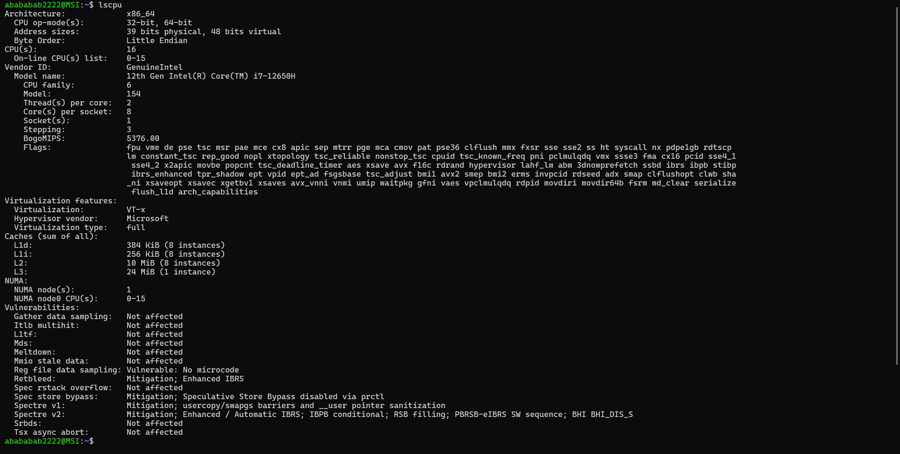

# Jobsheet 1

### Bab ini membahas cara Linux mendeteksi dan mengelola perangkat keras, modul
### kernel, driver perangkat, serta perintah-perintah dasar terminal Linux yang esensial
### untuk praktikum Ubuntu Server 22.04.

### praktikum ini dilakukan seluruhnya dalam WSL(Windows Subsystem for Linux)

## Praktikum 2.1 Identifikasi CPU dan Memori

praktikum ini bertujuan untuk memahami spesifikasi CPU dan memori pada VM.

### Melihat spesifikasi CPU
Spesifikasi CPU dapat dilihat dengan perintah sebagai berikut
```
~$ lscpu
```
Setelah perintah dijalankan, maka akan muncul status CPU seperti berikut:


informasi yang tampil berupa arsitektur cpu, merek, nama model, jumlah core dan thread, dan lain-lain.

### Melihat status memori(RAM)
Status RAM dapat dilihat dengan perintah terminal seperti berikut:
```
~$ free -h
```
Setelah perintah dijalankan, maka status RAM akan muncul seperti berikut:

Dengan perintah tersebut, status RAM seperti total memori yang dialokasikan, memori yang digunakan hingga RAM virtual(swap) dapat dilihat dari terminal

### Pertanyaan
#### Berdasarkan output perintah diatas:
1. Berapa jumlah CPU core/thread?
2. Berapa total RAM?
3. Berapa total SWAP?
4. Jelaskan perbedaan RAM dan SWAP dalam 2-3 kalimat

### Jawab
1. 16 core(s) w 2 thread(s) per core
2. 3.7 Gi
3. 1.0 Gi
4. RAM adalah memori fisik yang tersedia pada perangkat RAM. Sedangkan, SWAP adalah memori virtual yang dialokasikan di penyimpanan sebagai memori cadangan.

## Praktikum 2.2 Identifikasi Perangkat PCI dan USB

Praktikum ini bertujuan untuk mengenali perangkat PCI atau USB

### Lihat daftar PCI
Daftar perangkat PCI dapat dilihat dengan perintah berikut:
```
~$ lspci
```

Jika dijalankan, maka tampilan terminal menjadi seperti berikut:

Informasi yang dditampilkan berupa kartu grafis, kontrol penyimpanan virtual, dan perangkat lunak yang memungkinkan komunikasi antara windows dan linux

## Lihat perangkat PCI beserta kernel yang digunakan

Jika daftar perangkat PCI dilihat dengan `~$ lspci` maka untuk melihat perangkat PCI beserta kernel yang digunakan, maka perintah yang digunakan adalah sebagai berikut:
```
~$ lspci -nnk
```

Jika dijalankan, terminal akan menampilkan teks seperti berikut:
~[output lspci nnk](images/Screenshot%202026-02-18%20115001.png "Perangkat PCI dengan kernel")

tampilan terminal akan sama dengan perintah `~$ lspci`, namun dengan tambahan kernel yang digunakan setiap perangkat